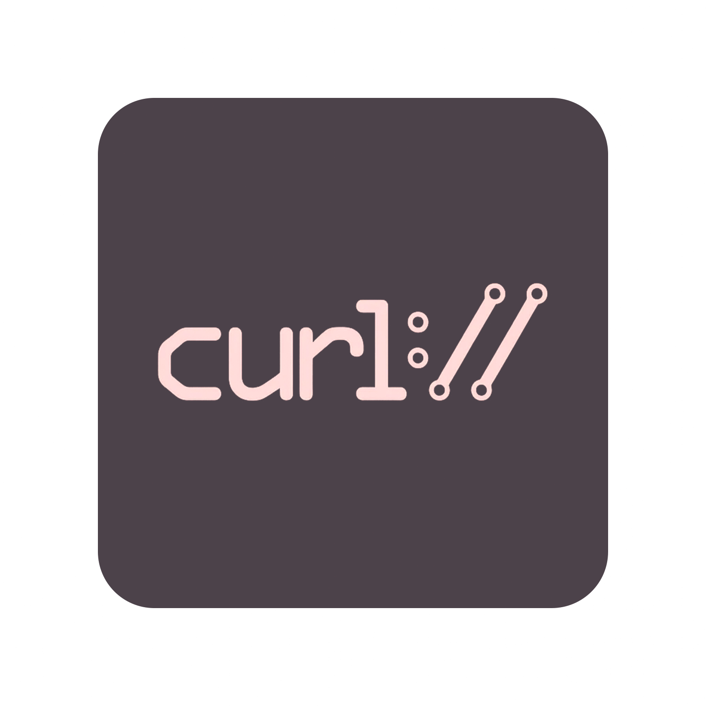

  

  

## 👨‍💻 About Me

I am 21 years old. I am a **middle Python developer at ru.shopping**. I parse European marketplaces, bypass protections of varying complexity, such as **Cloudflare**, **Akamay**, **CloudFront**, **DDOS Guard** and others. I really like scrapy for its convenience, speed and clarity. In order to find myself in parsing, I took 2 large courses on Yandex Praktikum for a backend developer. Therefore, sometimes I can still touch Django.

In my free time I exercise at a fitness club, paint pictures and sometimes travel with friends.

<h2 align="center">
  
  Skills
</h2>

  

     
    Python
  

  

     
    Scrapy
  

  

     
    Selenium
  

  

     
    Playwright
  

  

     
    curl_cffi
  

  

     
    Camoufox
  

  

